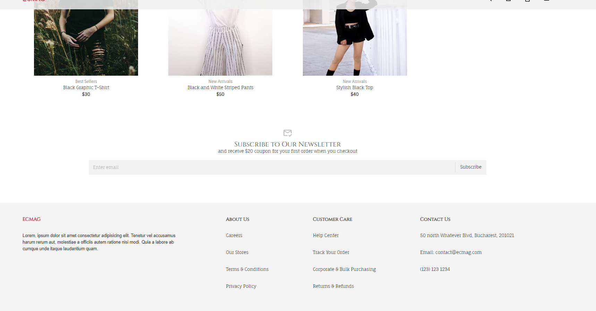
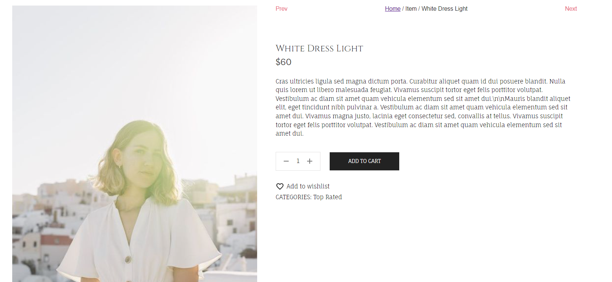
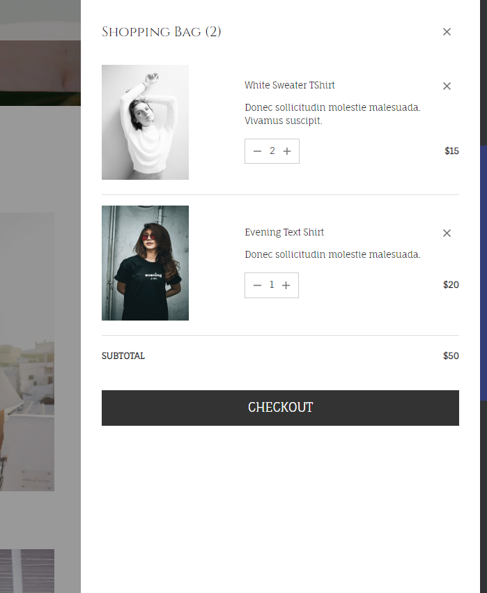
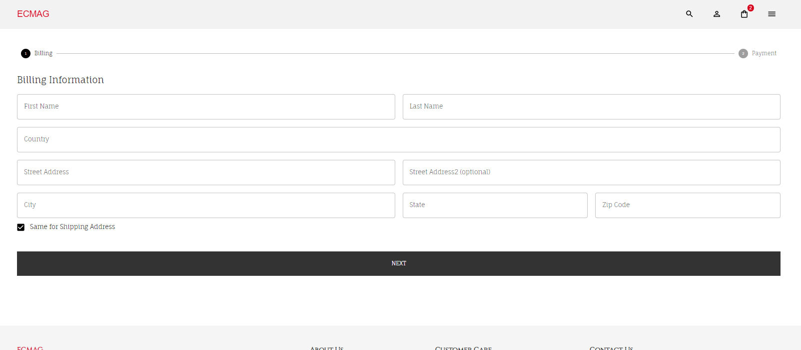
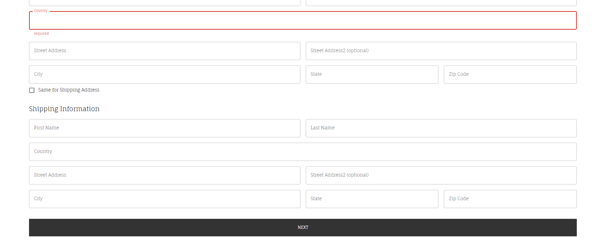
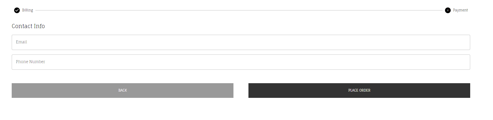
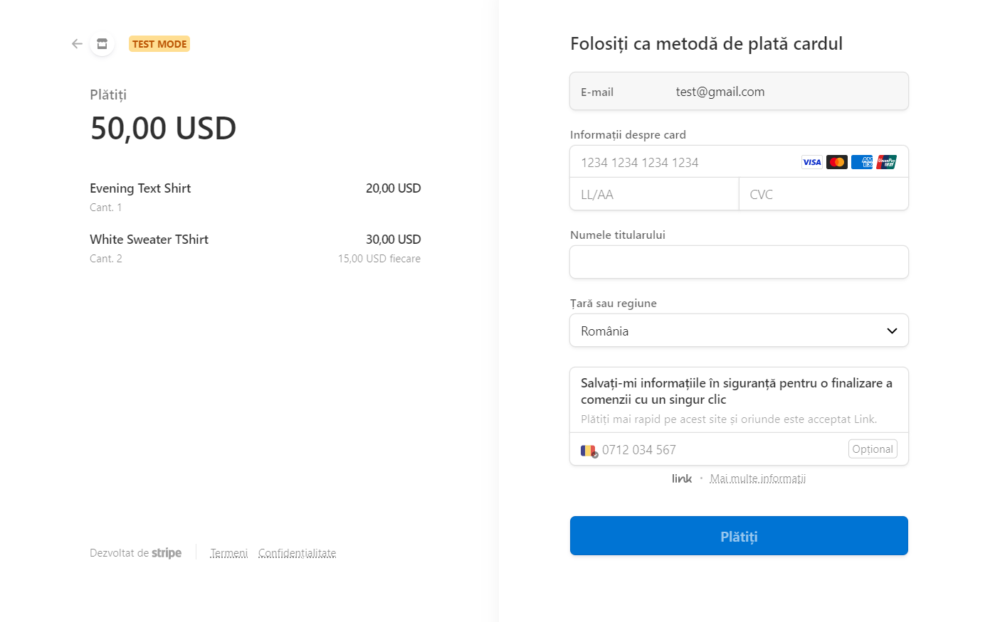
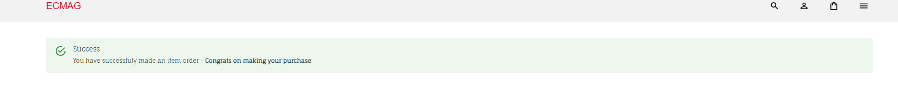

## ECommerce App

A responsive fullstack ecommerce shop made in React and TypeScript with Stripe integration and Strapi backend.

Fully responsive layout implemented using Material UI and React-responsive-carousel.

The users can add/manage products in page or in cart and then buy them using Stripe payment.

Other technologies/libraries used:

- Material UI for design
- React-responsive-carousel for home page carousel
- Formik for form handling
- Yup for form validation
- React Router for page navigation
- Redux & Redux Toolkit for frontend data storage

### App presentation

#### Home page

Home page with carousel presenting featured items, it can also be manually swiped left or right using the arrows.

The items presented by categories which the user can see filtered by clicking on the tabs, the user can also add items directly to the cart.

A subscribe section and the footer.

#### Item page

Individual item presentation page with the option to navigate through items, add to cart and see detailed information about the items.

A section containing more information about the individual item and reviews(not implemented) also possible related items(not implemented).

#### Cart

The cart where the user can see/manage their items and checkout to the payment information form if they decide to buy something.

#### Checkout page

The user is prompted to complete a form with their information.

If they want a different address for shippment, they can uncheck the mark and complete the information.  
The fields that are not filled will be marked in red.

After clicking the next button, the user is prompted for the last information before making the purchase.

#### Stripe payment

The stripe payment with information about the items and their quantity.

#### Success page

The user is redirected to a page to confirm their order was successful.

### What I learned?

In this project my focus was the implementation of Stripe with it's payment features and also Strapi backend.

How to make a responsive carousel with React-responsive-carousel.

Making a modern, ecommerce UI/UX with MUI.

How to use Formik and handle the validation with Yup.

### How to run ?

Frontend(client)

> npm run build

Backend(server)

> npm run build
